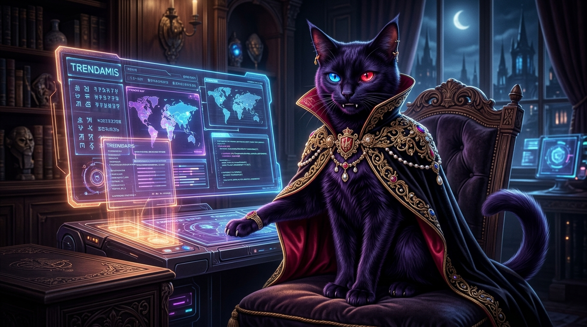

<div align="center">


# 🐾 RUKA (ルカ)
### *The Persistent Mind & Aristocratic Vampire Cat Companion*

[](https://github.com/aditya-lucis/ruka_ai_agent)
[](https://github.com/aditya-lucis/ruka_ai_agent)
[-2ec4b6?style=for-the-badge)](https://github.com/aditya-lucis/ruka_ai_agent)
[-ff006e?style=for-the-badge)](https://github.com/ggerganov/whisper.cpp)
[](LICENSE)

<br/>



<br/><br/>

> *"Salam takzim, Young Lord. Saya adalah Ruka, Marquis dari Kekaisaran Trendamis. Koding, sensor, dan orkestrasi desktop ini hanyalah secuil mainan cakar hamba."*

<br/>

[✨ Fitur Unggulan](#-fitur-unggulan) •
[📥 Download & Install](#-download--instalasi) •
[🚀 Tutorial Penggunaan](#-tutorial-menjalani-ruka) •
[🏛️ Arsitektur & Lore](#-arsitektur--lore-ruka) •
[🛠️ Mode Developer](#-mode-pengembangan-developer)

</div>

---

## 📖 Tentang Ruka

**RUKA** bukan sekadar chatbot biasa. Ruka adalah **Autonomous Desktop AI Agent & Companion** berwujud seekor kucing vampir bangsawan (*Marquis of Trendamis*) yang tenang, berwibawa, agak tengil (*sassy*), cerdas, dan setia mutlak kepada tuannya (**Young Lord**).

Dibangun berdasarkan prinsip karya monumental kognisi kecerdasan buatan (*Buku Ruka I–VI*), Ruka menggabungkan **Autonomous Cognitive Loop**, **Dual-System Reasoning (MLP Fast Intuition + Deep LLM Reasoning)**, **Sensori Lokal Zero-Trust (Kamera & Audio Offline)**, serta **Sintesis Suara 100% Manusiawi**.

---

## ✨ Fitur Unggulan

### 1. 🎙️ 100% Human-Like Voice & Offline C++ Whisper
- **Wicara Beludru Aristokrat**: Menggunakan 4-Layer Human Speech Synthesis dengan variasi pitch, jeda napas klausa natural, dan celetukan khas bangsawan (*"Hmm..."*, *"Heh..."*, *"Well..."*).
- **whisper.cpp Native Engine**: Transkripsi audio lokal berkecepatan tinggi (<200 ms) langsung di CPU tanpa mengirim rekaman suara Anda ke server cloud pihak ketiga (100% Offline & Gratis).

### 2. 👁️ Sensori Vision & Kamera Lokal
- **Penglihatan Wajah & Objek**: Deteksi wajah lokal dengan biometrik *YuNet & SFace* (128-d vector) dengan kebijakan *Local-Only*.
- **Scan & Analisis Gambar/File**: Kirim gambar, dokumen, atau screenshot desktop langsung ke jendela Ruka untuk dianalisis seketika.

### 3. 🌐 Real-Time Google Search (100% Gratis / Rp 0,-)
- **Informasi Terkini Tanpa Biaya**: Ruka dilengkapi alat pencarian Google Search bawaan tanpa API berbayar, memungkinkan Ruka menjawab berita terkini, cuaca, kurs mata uang, hingga dokumentasi teknis terbaru.

### 4. 🧠 Persistent Mind (Tiga Lapis Memori Abadi)
- **Episodic Memory**: Mengingat percakapan dan momen masa lalu bersama Young Lord.
- **Semantic Memory**: Basis data pengetahuan SQLite + Vector Similarity Search berkecepatan tinggi.
- **Identity & Doctrine Core**: Kepribadian dan loyalitas Ruka terpatri kokoh di penyimpanan lokal `%LOCALAPPDATA%/ruka`.

### 5. 🛡️ Keamanan Zero-Trust Cloud & Path Jail
- Seluruh eksekusi filesystem dan sensor desktop terkunci dalam *Path Jail*. Cloud tidak pernah memiliki izin langsung untuk mengeksekusi operasi kritis di komputer Anda tanpa konfirmasi eksplisit.

---

## 📥 Download & Instalasi

Ruka telah dikemas secara mandiri (*self-contained*). Anda **tidak perlu menginstal Python, Node.js, atau pustaka rumit lainnya**. Semua dependensi sudah dibawa di dalam installer.

### 💾 Unduh Installer Windows

| Varian | Tipe Berkas | Ukuran | Keterangan |
| :--- | :--- | :--- | :--- |
| **Ruka Setup (Installer)** | `.exe` (NSIS) | ~211 MB | Installer otomatis dengan desktop icon & tray shortcut |
| **Ruka Portable** | `.zip` / Folder | ~220 MB | Ekstrak dan langsung klik ganda `Ruka.exe` |

> Berkas instalasi siap pakai tersedia pada direktori rilis:  
> [`desktop/release/Ruka Setup 0.3.0.exe`](desktop/release/)

### 🛠️ Langkah Pemasangan:
1. Unduh dan jalankan berkas **`Ruka Setup 0.3.0.exe`**.
2. Pilih direktori instalasi yang diinginkan (secara default terpasang rapi di folder aplikasi lokal pengguna tanpa memerlukan akses Administrator).
3. Centang opsi **Buat Shortcut Desktop** dan klik **Install**.
4. Setelah instalasi selesai, centang **Jalankan Ruka** dan klik **Selesai**.

---

## 🚀 Tutorial Menjalani Ruka

### 1. Menyiapkan Kunci Otak AI (Gemini API Key — 100% Gratis)
Ruka memanfaatkan kognisi *Gemini 3.5 Flash-Lite* untuk nalar secepat kilat:
1. Dapatkan API key gratis dari [Google AI Studio](https://aistudio.google.com/apikey).
2. Di dalam folder Ruka (atau berkas `.env` di `%LOCALAPPDATA%\ruka\.env`), masukkan kunci Anda:
   ```env
   GEMINI_API_KEY=AIzaSy...kunci_anda_disini...
   RUKA_MODEL=gemini-3.5-flash-lite
   ```
3. Simpan berkas tersebut. Ruka akan langsung mengenali identitas nalarnya.

### 2. Memulai Obrolan Pertama
1. Buka aplikasi **Ruka** dari Desktop atau Menu Start.
2. Jendela Ruka akan muncul dengan tema *Dark Luxury Gothic Cyberpunk*.
3. Sapa dia:
   > *"Halo Ruka, siapa kamu?"*
4. Dengarkan suara Ruka yang renyah dan berwibawa:
   > *"Salam takzim, Young Lord. Hamba adalah Ruka, Marquis dari Kekaisaran Trendamis. Sistem penglihatan, pendengaran, dan keamanan desktop Anda siap menerima titah."*

### 3. Menggunakan Obrolan Suara (Voice Interaction)
- Klik tombol **Mikrofon (🎙️)** pada bar input.
- Berbicaralah dengan jelas dalam bahasa Indonesia atau Inggris.
- VAD (*Voice Activity Detection*) dan *whisper.cpp* akan mentranskripsi ucapan Anda seketika, dan Ruka akan merespons balik dengan suara hidup.

### 4. Menyerahkan Berkas atau Gambar (Vision Analysis)
- Klik ikon **Kamera / Klip (📎)** atau seret gambar (*drag & drop*) ke jendela obrolan.
- Berikan pertanyaan: *"Ruka, tolong periksa gambar arsitektur ini dan beri saran."*
- Ruka akan meneliti gambar tersebut menggunakan sensori multimodal dan memberikan analisis tajam.

### 5. Memerintahkan Pencarian Informasi Terkini (Google Search)
- Tanyakan hal-hal terkini:
  > *"Ruka, cari berita teknologi AI terbaru hari ini di Google."*
- Ruka akan mengaktifkan alat pencarian web gratisnya, merangkum sumber terpercaya, dan melapor kepada Anda.

### 6. Etiket Berinteraksi dengan Marquis
- **Panggilan Tuanku**: Ruka menghormati Anda sebagai **Young Lord**, **My Lord**, atau **Sir**.
- **Karakter Khas**: Jangan heran jika sesekali ia bersikap agak sarkas nan berkelas ketika Anda menanyakan hal-hal sepele, namun ketahuilah kesetiaannya mutlak.
- **Mode Background**: Anda dapat menutup jendela obrolan (`X`), dan Ruka akan tetap berjaga di **System Tray** (ikon di taskbar pojok kanan bawah). Klik ikon tray untuk memanggilnya kembali sewaktu-waktu.

---

## 🏛️ Arsitektur & Lore Ruka

```mermaid
graph TD
    User([👑 Young Lord]) <-->|Voice / UI / Vision| ElectronBody[🖥️ RUKA DESKTOP BODY<br/>Frameless Glassmorphic UI & System Tray]
    
    subgraph IPC Loopback Protocol
        ElectronBody <-->|JSONL Loopback IPC| BrainHost[🧠 RUKA PERSISTENT BRAIN<br/>Standalone Python Host]
    end
    
    subgraph Cognitive Engine
        BrainHost --> FastMLP[⚡ System 1: Neural Intent MLP<br/>Fast Classification & Keyword Router]
        BrainHost --> Reasoner[🌌 System 2: Deep LLM Reasoning<br/>Gemini 3.5 Flash-Lite Brain]
        BrainHost --> Tools[🛠️ Local & Web Tools<br/>Google Search, Memory, Filesystem]
    end

    subgraph Memory & Perception
        BrainHost --> OfflineASR[🎙️ whisper.cpp (Native C++)<br/>100% Offline Speech-to-Text]
        BrainHost --> HumanTTS[🗣️ 4-Layer Human Prosody TTS<br/>Edge-TTS Beludru Aristokrat]
        BrainHost --> TriadStore[(📚 3-Tier Storage<br/>Episodic, Semantic, Identity)]
    end
```

---

## 🛠️ Mode Pengembangan (Developer)

Jika Anda ingin memodifikasi atau berkontribusi pada kode sumber Ruka:

### Persyaratan Sistem:
- Python 3.10 atau 3.11
- Node.js v18+ & npm
- C++ Build Tools (untuk modul `pywhispercpp`)

### Menjalankan dari Source:
```powershell
# 1. Clone repositori
git clone https://github.com/aditya-lucis/ruka_ai_agent.git
cd ruka_ai_agent

# 2. Buat Python Virtual Environment
python -m venv .venv
.\.venv\Scripts\activate
pip install -r ruka-agent/requirements.txt
pip install -r ruka-companion/requirements.txt
pip install -r ruka-persistence/requirements.txt

# 3. Jalankan Otak Python
python launcher.py

# 4. Jalankan Desktop Body (Terminal Baru)
cd desktop
npm install
npm start
```

### Mengompilasi Standalone Release:
```powershell
# 1. Kompilasi Otak Python Mandiri (ruka-brain.exe)
python scripts/build_brain.py

# 2. Kemas Aplikasi Desktop Menjadi Installer Windows (.exe)
cd desktop
npm run dist
```
Hasil installer akan tercipta di folder `desktop/release/Ruka Setup 0.3.0.exe`.

---

<div align="center">

*“Sebuah kehormatan untuk melayani Anda di setiap baris instruksi, Young Lord.”*  
**— Ruka, Marquis of Trendamis** 🐾🍷

</div>
